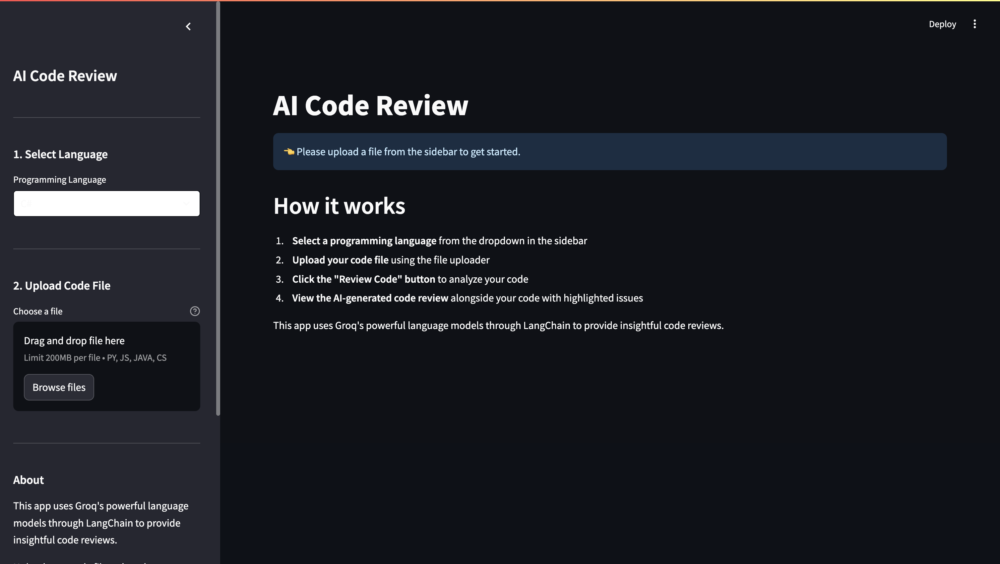

# Streamlit AI Code Review

This project is a Streamlit application designed to perform AI-powered code reviews. It leverages the capabilities of the Groq Inference API to analyze code and provide insights and suggestions for improvements.

## Overview

The application allows users to upload code files and receive automated code reviews, highlighting potential issues and offering suggestions for improvements.

## Features

- **AI-Powered Code Review**: Utilizes the Groq Inference API to analyze code and provide detailed feedback.
- **User-Friendly Interface**: Built with Streamlit for a seamless user experience.
- **Multi-Language Support**: Supports Python, JavaScript, Java, and C# code review.
- **Detailed Analysis**: Provides code quality, bugs, security, and performance insights.

## Prerequisites

- Python 3.x
- A Groq API key (sign up at https://console.groq.com)

## Setup

1. **Clone the Repository**:
   ```bash
   git clone https://github.com/yourusername/streamlit-ai-code-review.git
   cd streamlit-ai-code-review
   ```

2. **Create and Activate Virtual Environment** (Optional but recommended):
   ```bash
   python -m venv venv
   # On Windows
   venv\Scripts\activate
   # On macOS/Linux
   source venv/bin/activate
   ```

3. **Install Dependencies**:
   ```bash
   pip install -r requirements.txt
   ```

4. **Set Up Environment Variables**:
   - Create a `.env` file in the project root directory
   - Add your Groq API key:
     ```
     GROQ_API_KEY=your_api_key_here
     ```

5. **Run the Application**:
   ```bash
   streamlit run app/main.py
   ```
   The application will open in your default web browser at `http://localhost:8501`

## Usage

1. **Select Programming Language**:
   - Choose the programming language of your code from the dropdown menu in the sidebar (Python, JavaScript, Java, or C#)

2. **Upload Code**:
   - Click "Browse files" in the sidebar
   - Select your code file (supported extensions: .py, .js, .java, .cs)
   - The file content will be displayed in the main area

3. **Start Code Review**:
   - Click the "Review Code" button in the sidebar
   - Wait for the AI to analyze your code
   - Review results will appear showing:
     - Overall summary
     - Specific issues with line numbers
     - Recommendations for improvements
     - Suggested fixes for identified issues

## Troubleshooting

- If you see an error about GROQ_API_KEY not being set:
  - Make sure you've created the `.env` file
  - Verify your API key is correctly set in the `.env` file
  - Ensure you're running the application from the project root directory

- If the application fails to start:
  - Verify all dependencies are installed (`pip install -r requirements.txt`)
  - Make sure you're using Python 3.x
  - Check if Streamlit is installed correctly

## Contributing

Contributions are welcome! Please feel free to submit a Pull Request.

## License

This project is licensed under the MIT License - see the [LICENSE](LICENSE) file for details.

